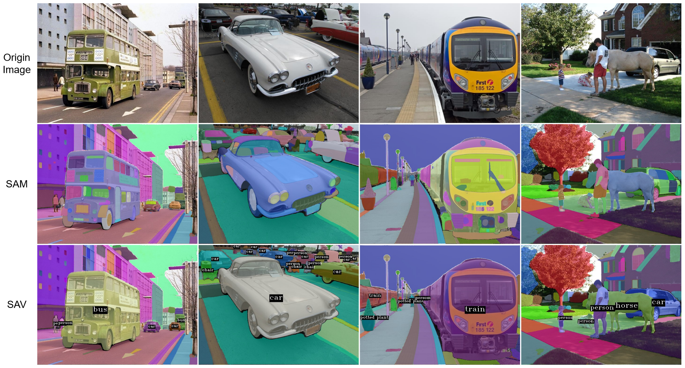

[English](README.md) | [简体中文](README.zh-CN.md)

**简介**

- 由 facebook 提出的 SAM 模型在计算机视觉领域产生了非常重要的影响，这是因为它在许多任务中作为一个基础的步骤，比如边缘检测，人脸识别和自动驾驶。但是，SAM 有两个缺陷：(1) 它不返回图像区域的语义信息，(2) 它可能会将一个实例(例如，一辆车)分割成各式各样的小区域，(3) 模型不能处理视频数据。
- 在这个项目中，我们用 YOLOv8 和 SAM 实现了一种图像分割方法和一种目标跟踪方法，它可以解决上述 SAM 的两个问题，我们将该方法称之为分割任意视频(SAV)。
- 在 seg.py 中，我们的分割方法可以通过 YOLOv8 检测器得到的结果作为提示框传入到 SAM，并保留无语义信息区域的方式来解决，这是与 SAM 最大的不同点。
在 track.py 中，我们修改代码 [ultralytics/tracker/track.py](https://github.com/ultralytics/ultralytics/tree/main/ultralytics/tracker/track.py)，它提供了 ByteTrack 和 BoTSORT 两种跟踪方法，然后将实例分割应用到视频的每一帧。

**安装**
```bash
pip install ultralytics
pip install git+https://github.com/facebookresearch/segment-anything.git
```

**模型权重文件**
- [ViT-L SAM model](https://dl.fbaipublicfiles.com/segment_anything/sam_vit_l_0b3195.pth)
- [ViT-B SAM model](https://dl.fbaipublicfiles.com/segment_anything/sam_vit_b_01ec64.pth)
- [ViT-H SAM model](https://dl.fbaipublicfiles.com/segment_anything/sam_vit_h_4b8939.pth)
- [YOLOv8n](https://github.com/ultralytics/assets/releases/download/v0.0.0/yolov8n.pt)
- [YOLOv8s](https://github.com/ultralytics/assets/releases/download/v0.0.0/yolov8s.pt)
- [YOLOv8m](https://github.com/ultralytics/assets/releases/download/v0.0.0/yolov8m.pt)
- [YOLOv8l](https://github.com/ultralytics/assets/releases/download/v0.0.0/yolov8l.pt)
- [YOLOv8x](https://github.com/ultralytics/assets/releases/download/v0.0.0/yolov8x.pt)

**使用**
```bash
python seg.py --img_path TestImages --save_dir SegOut --sam_checkpoint model/sam_vit_h_4b8939.pth --yolo_checkpoint model/yolov8x.pt
```
或
```bash
python track.py --video_path video.mp4 --save_path video_test.mp4 sam_checkpoint model/sam_vit_h_4b8939.pth --yolo_checkpoint model/yolov8x.pt --imgsz 1920
```

**图像分割结果**
<div align=center>

</div>
<div align=center>我们从上面结果观察到，我们的方法可以将巴士、小汽车和火车分割成一个完整的区域，而 SAM 分割成不同的区域。</div>

**视频跟踪结果**
<div align=center>

</div>
<div align=center>目标分割和跟踪</div>

<div align=center>

</div>
<div align=center>目标分割和跟踪</div>

<div align=center>

</div>
<div align=center>目标分割和跟踪</div>

<div align=center>

</div>
<div align=center>Segment and track</div>

**演示**

- 在线演示在 [这里](http://sav.cstor.cn)。
- 注意: 考虑到视频分割与跟踪非常耗时，所以我们没有集成这个功能。如果你对此感兴趣，你可以克隆该项目，并在自己的GPU机器上运行。

**工作计划**
- [ ] 用 object365 数据集训练 YOLOv8 模型
    - [x] [YOLOv8m.pt](https://pan.baidu.com/s/1Lhbl_ez5sCC81j-s6RvP6A)  extract code: 65ge
    - [ ] YOLOv8n.pt
    - [ ] YOLOv8s.pt
    - [ ] YOLOv8l.pt
    - [ ] YOLOv8x.pt

**许可证**
- 这份代码的许可证是 [AGPL-3.0 许可证](./LICENSE)。
